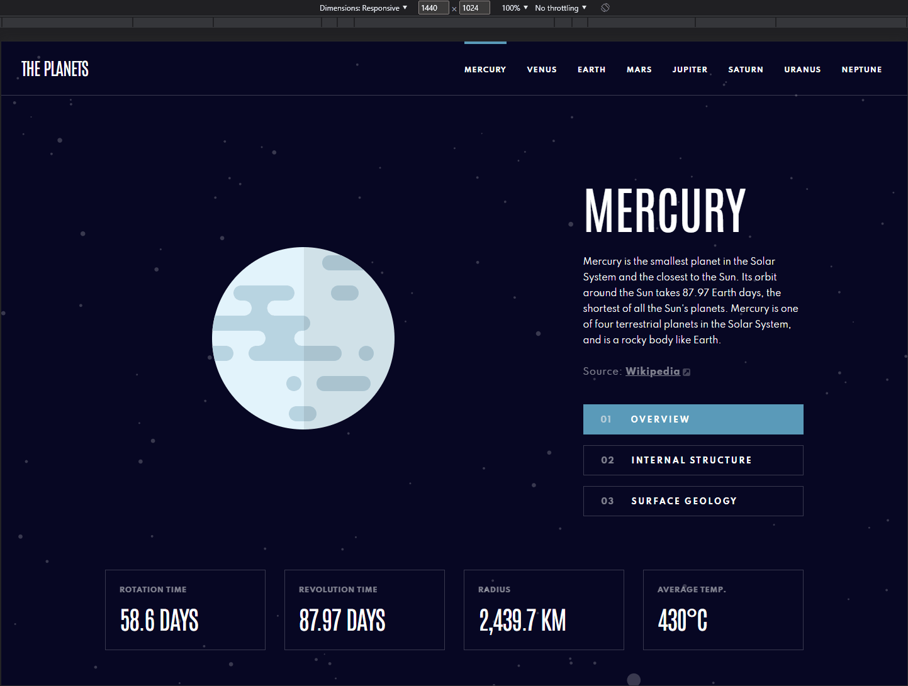

# Planet Information Website created with Next JS and CSS Modules

<div align="center"></div>

The goal of the project is to create a functional website which displays various facts and images about planets in our solar system.

Three goals I aimed to achieve with this project are:

1. Get practice with Next JS by understanding how to set routes, create static pages, and display data on the page.
2. Use CSS modules to style the application instead of frameworks such as styled-components or bootstrap.
3. Make every webpage accessible to the best of my abilites.

## Techstack Used

This Project was boostrapped with [create-next-app](https://nextjs.org/docs/api-reference/create-next-app) using the [Typescript](https://www.typescriptlang.org/) template, using most of the default configurations provided by the script.

The following are the main tools used to create the application.

- [NextJS](https://nextjs.org/), a React framework that is used to create server-side rendered applications.
- [React](https://reactjs.org/), a JavaScript library for building user interfaces
- [Cypress](https://docs.cypress.io/guides/overview/why-cypress), a front-end testing tool to create integration and unit test.

Other tools used is [css-modules](https://github.com/css-modules/css-modules) which is a way to write css in a more modular fashion.

## Running the Application

Once the application has been cloned to your local machine, navigate to the project directory and run `npm i` to install dependencies.

To run the application in **development mode**, run the command `npm run dev`, you can reach the page at [localhost:3000](http://localhost:3000)

To run the **production build** of the application, run the command `npm run build` to build the application, then run the command `npm run start` to run the application at [localhost:3000](http://localhost:3000)

## Development Process

This section will go over the development process of the project and will discuss some fo the challenges I faced.

### Next JS

One of the main goals of this project was to use Next JS for the first time and understand the basics of the framework. The main feature I wanted to implement was to have the each planet page be generated statically, since the data is rarely going to change, there is no a need for the page to be dynamically generated on each request.

```typescript
export const getStaticPaths: GetStaticPaths = async () => {
  const paths = await getPlanetPaths();
  return {
    paths,
    fallback: false,
  };
};

export const getStaticProps: GetStaticProps = async ({ params }) => {
  const id = params?.id;
  if (id && typeof id === "string") {
    const planetData = await getPlanetData(id);
    if (!planetData) return { notFound: true };
    else
      return {
        props: {
          planetData,
        },
      };
  } else {
    return { notFound: true };
  }
};
```

The static generation can be implemented with `getStaticPaths` and `getStaticProps`.

- `getStaticPaths`, will generate all the possible paths that can be reached, the paths are the planet names which are retrieved from the [planets.json](/public/planets.json) file.
- `getStaticProps`, grabs the planet data from [planets.json](/public/planets.json), based on the planet name passed in through the params.

### CSS Modules

CSS Modules allow for one to write CSS in a more modular way, for example, all styles for the navigation bar can be found in the [navbar.module.css](./src/components/NavBar/NavBar.module.css) file. Each component or route can contain one module dedicated for it.

Writing in CSS modules makes it easier for me to see what styles directly style a component/page. I ensured to also make the pages responsive with the use of media queries and CSS Grid.

## Conclusion and Plans

Overall this was a simple but very informative project to work on, I was able to get a good undestanding of Next JS which will assist me in the development of future projects.

Some things I want to improve upon in the future for this application include:

1. Break down the [id.tsx](./src/pages/planets/%5Bid%5D.tsx) page so that it uses components for each part of the page, which will cut down on the size of the CSS module file for it as well.
2. Implement meta tags to improve SEO for each page.
